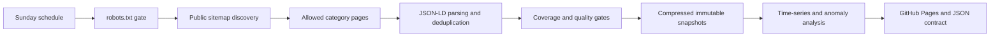

# Stop & Shop Research

[](https://github.com/frankstop/StopShopResearch/actions/workflows/weekly_crawl.yml)
[](https://www.python.org/)
[](LICENSE)

Automated longitudinal research on Stop & Shop's anonymous public online catalog. Every Sunday, the project discovers the current grocery sitemap, collects structured product observations from allowed category pages, validates the result, compares it with prior successful weeks, and publishes [price intelligence](https://frankstop.github.io/StopShopResearch/weekly-report.html) plus a searchable [all-item price history](https://frankiejvaldez.com/projects/stopshopresearch/catalog-history/).

The Baldwin Stop & Shop at **905 Atlantic Avenue, store #2577** establishes the local market context. Collected prices come from Stop & Shop's public online catalog and are **not asserted to be Baldwin shelf prices**.

## What the pipeline produces

- Immutable compressed catalog and promotion snapshots under `data/snapshots/`
- Coverage, overlap, valid-price, and product-drop safety gates
- Week-to-week price increases, decreases, assortment churn, and availability changes
- Category and brand trends, advertised promotion summaries, and four/eight-week volatility
- Conservative anomaly flags requiring both a 20% price move and a robust MAD z-score of 3.5
- A static [project overview](https://frankstop.github.io/StopShopResearch/) and [weekly report](https://frankstop.github.io/StopShopResearch/weekly-report.html)
- A searchable union catalog where every observed item retains its complete non-interpolated history
- A stable [machine-readable weekly summary](https://frankstop.github.io/StopShopResearch/data/weekly-summary.json)

No account, loyalty card, private API, CAPTCHA workaround, or authenticated state is used.

## Architecture



See [Architecture](docs/ARCHITECTURE.md), [Data Dictionary](docs/DATA_DICTIONARY.md), and [Methodology and Limitations](docs/METHODOLOGY.md) for the full contracts.

## Run locally

Python 3.11 or newer is required. The runtime has no third-party dependencies.

```bash
python3 -m unittest discover -v

# Small live smoke run into a temporary directory. Thresholds are intentionally
# lowered only for the smoke test; do not use this as a production baseline.
python3 -m stopshop_research run \
  --root /tmp/stopshop-smoke \
  --max-categories 3 \
  --minimum-products 1 \
  --minimum-sitemap-coverage 0 \
  --delay 1

# Production collection and reporting
python3 -m stopshop_research run --verbose

# Rebuild reports from existing snapshots without network access
python3 -m stopshop_research report
```

The production defaults require at least 15,000 products and 60% sitemap coverage. Later runs must also retain at least 80% overlap with the prior snapshot and avoid an unexplained product-count drop above 25%.

## Data-use boundary

The collector identifies itself, runs serially with at least one second between requests, honors current robots rules, and uses only public first-party grocery and savings pages. It deliberately avoids `/api/`, `/product-search/`, `/browse-aisles/`, authentication, and personalized offers.

## Status semantics

The first healthy run establishes a real baseline. A real week-to-week comparison appears only after the second healthy run. The project does not manufacture historical snapshots, interpolate missing prices, or present predictive-model claims.

## License and affiliation

Code is released under the [MIT License](LICENSE). Collected observations remain attributable to their source URLs. This independent educational project is not affiliated with or endorsed by Stop & Shop or Ahold Delhaize.
